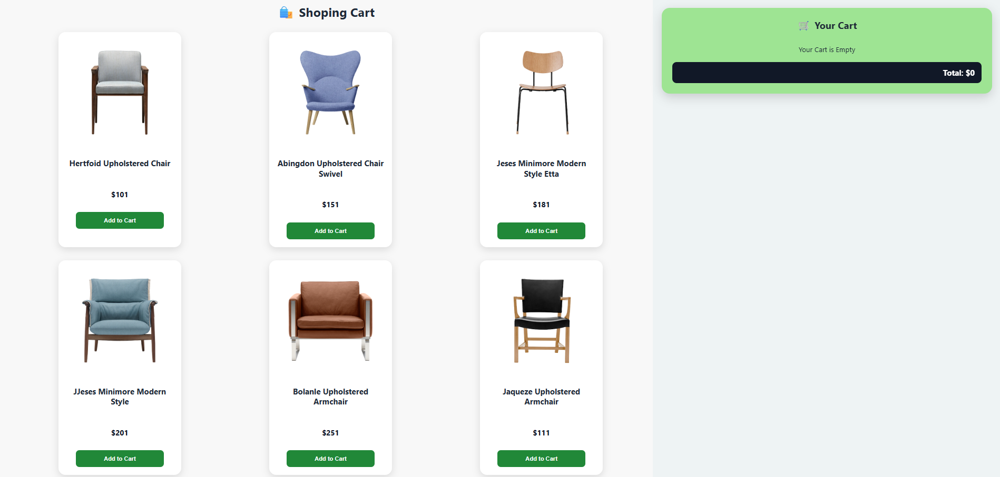
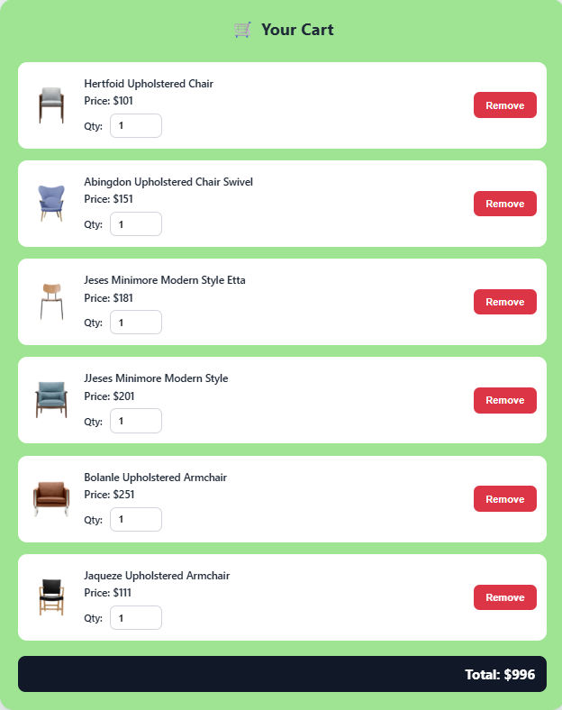

# 🛒 Shopping Cart Website

## 📖 Overview

The Shopping Cart Website is a responsive web application developed using HTML, CSS, and JavaScript. It allows users to browse products, add items to a shopping cart, update product quantities, remove items, and view the total cart value in real time. The project focuses on providing a smooth and user-friendly online shopping experience.

---

## Live Demo

https://saikumar-009.github.io/Shoping-Cart/

---

## GitHub Repository

Repository Link:
https://github.com/saikumar-009/Shoping-Cart

---

## 📸 Screenshots
### Home Page

### Cart Page

## ✨ Features

- Display products with images, names, and prices
- Add products to the shopping cart
- Increase or decrease product quantity
- Remove products from the cart
- Real-time total price calculation
- Dynamic cart updates using JavaScript
- Responsive design for mobile, tablet, and desktop devices
- Clean and user-friendly interface

---

## 🛠 Technologies Used

- HTML5
- CSS3
- JavaScript (ES6)

---

## 📂 Project Structure

shopping-cart/

├── index.html

├── style.css

├── script.js

├── images/

└── README.md

---

## ⚙️ How It Works

1. Users browse products displayed on the website.
2. Clicking the "Add to Cart" button adds a product to the cart.
3. Users can increase or decrease product quantities.
4. The cart automatically updates the total price.
5. Users can remove products from the cart at any time.
6. All updates are handled dynamically using JavaScript.

---

## 🧩 Challenges Faced

- Managing cart data efficiently using JavaScript.
- Updating the user interface dynamically.
- Calculating total prices in real time.
- Creating a responsive layout for different screen sizes.

---

## 📚 Future Enhancements

- Product search functionality
- Product filtering and sorting
- User authentication
- Wishlist feature
- Local storage integration
- Checkout and payment gateway integration

---

## 👨‍💻 Author

ALUPANA SAI

GitHub: https://github.com/saikumar-009

LinkedIn: https://www.linkedin.com/in/alupanasai/

---

## Learning Outcomes

- DOM Manipulation
- Event Handling
- Responsive Web Design
- JavaScript Arrays and Objects
- Frontend Development
- Problem Solving and Debugging

## ⭐ Support
If you like this project, give it a star.

